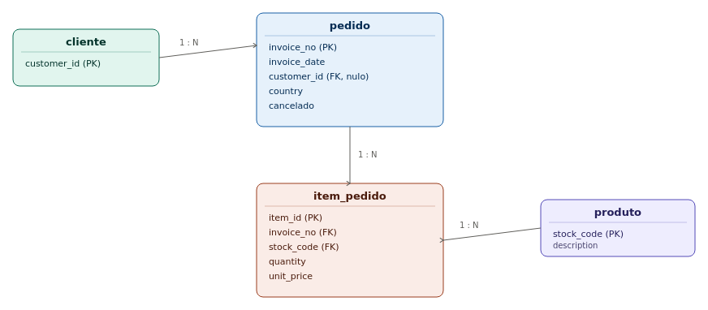

# Online Retail — Modelagem de banco de dados

Modelagem relacional (3FN) construída a partir do dataset `Online_Retail.xlsx` (541.909 linhas, 8 colunas originais: `InvoiceNo`, `StockCode`, `Description`, `Quantity`, `InvoiceDate`, `UnitPrice`, `CustomerID`, `Country`).

## Diagrama entidade-relacionamento



## Estrutura das tabelas

### `cliente`

| Coluna | Tipo | Descrição |
|---|---|---|
| `customer_id` **PK** | INT | Identificador único do cliente (4.372 distintos na base). |

### `produto`

| Coluna | Tipo | Descrição |
|---|---|---|
| `stock_code` **PK** | VARCHAR(20) | Código do produto (4.070 distintos). |
| `description` | VARCHAR(255) | Descrição canônica do produto. |

### `pedido`

| Coluna | Tipo | Descrição |
|---|---|---|
| `invoice_no` **PK** | VARCHAR(20) | Número da fatura (texto, pois cancelamentos usam prefixo `C`). |
| `invoice_date` | DATETIME | Data/hora do pedido. |
| `customer_id` **FK** | INT (nulo) | Referencia `cliente.customer_id`; nulo em pedidos sem cadastro (~135 mil linhas). |
| `country` | VARCHAR(60) | País de entrega do pedido (38 países distintos). |
| `cancelado` | BOOLEAN | Derivado do prefixo `C` no `InvoiceNo` original (3.836 faturas). |

### `item_pedido`

| Coluna | Tipo | Descrição |
|---|---|---|
| `item_id` **PK** | BIGINT (auto) | Chave substituta (surrogate); o par `invoice_no` + `stock_code` se repete até 20 vezes num mesmo pedido. |
| `invoice_no` **FK** | VARCHAR(20) | Referencia `pedido.invoice_no`. |
| `stock_code` **FK** | VARCHAR(20) | Referencia `produto.stock_code`. |
| `quantity` | INT | Quantidade vendida; pode ser negativa (devolução). |
| `unit_price` | DECIMAL(10,2) | Preço unitário; pode ser 0 (brinde/ajuste). |

## Qualidade dos dados na origem

- **1.454** linhas sem `Description`
- **135.080** linhas sem `CustomerID`
- **3.836** faturas canceladas (prefixo `C`)
- **10.624** linhas com `Quantity` negativa
- **2.515** linhas com `UnitPrice` = 0

Esses pontos foram tratados como características do negócio (devoluções, brindes, pedidos sem cadastro) e não como erros a corrigir — cada um gerou uma decisão de projeto refletida no schema.

## Arquivos do repositório

| Arquivo | Descrição |
|---|---|
| `online_retail_modelagem.sql` | Script DDL completo (`CREATE TABLE`, chaves estrangeiras e índices). |
| `online_retail_modelagem.pdf` | Documento com diagrama, dicionário de dados e notas de qualidade. |
| `assets/diagrama-er.png` | Imagem do diagrama entidade-relacionamento. |

## Como usar

```bash
mysql -u usuario -p nome_do_banco < online_retail_modelagem.sql
```

O script cria as tabelas na ordem correta de dependência (`cliente` → `produto` → `pedido` → `item_pedido`) e os índices recomendados para consultas analíticas (por cliente, por data, por produto).

Link para baixar o arquivo original https://www.kaggle.com/datasets/ersany/online-retail-dataset?utm_source=chatgpt.com

